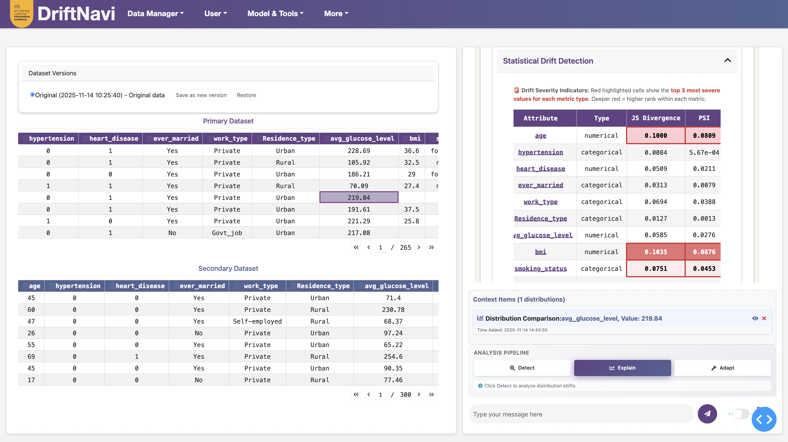
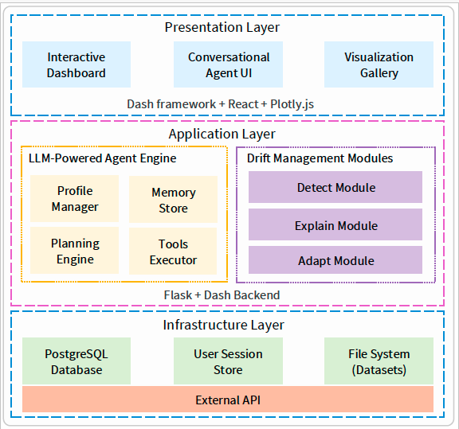

# DriftNavi

**DriftNavi** is an LLM-powered toolkit for managing dataset drift, developed by the [ARC Training Centre for Information Resilience (CIRES)](https://cires.org.au/). It integrates a large language model (LLM)-based autonomous agent with modular components for drift detection, explanation, and adaptation. Through a natural language interface, DriftNavi guides users—regardless of technical background—through the drift analysis pipeline with personalized and context-aware interactions.

## Demonstration Video

🎥 [Watch the demo](https://drive.google.com/file/d/1iWYCqq4T7j3_lIThlVHcv85msWjNA4zv/view?usp=drive_link)

## Features

- 💬 **Conversational interface** for drift analysis  
- 📊 **Statistical and visual tools** integrated with LLM responses  
- 🧠 **Persona-driven explanations** tailored to user expertise  
- 🔧 **Hybrid adaptation methods**, including coreset selection and stratified resampling  
- ⚙️ **Modular architecture** for easy customization and extension  

DriftNavi follows a three-stage pipeline:

**Detect → Explain → Adapt**

---

## User Interface

---

## System Architecture

The system is organized into three layers:

1. **Presentation Layer** — Chat interface, statistics dashboard, and visualization gallery  
2. **Application Layer** — LLM agent engine, prompt planner, drift modules  
3. **Infrastructure Layer** — Database, session store, file system, and OpenAI API interface

---

### Acknowledgements

DriftNavi builds upon the excellent work of tools such as:

- CoreTab for coreset-based sampling
- Evidently for statistical drift metrics

